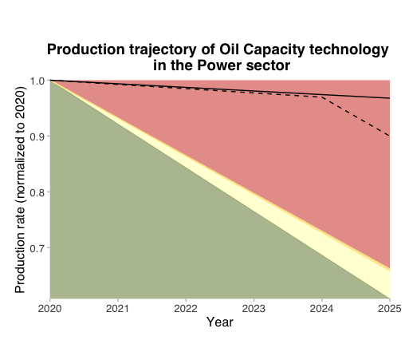
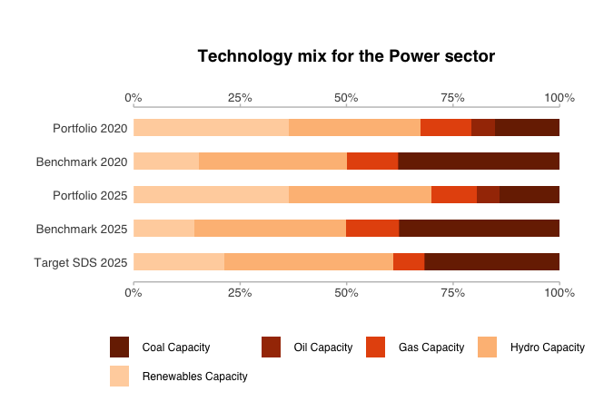

<!-- README.md is generated from README.Rmd. Please edit that file -->

# r2dii.ggplot <a href='https://github.com/2DegreesInvesting/r2dii.ggplot'></a>

<!-- badges: start -->

[](https://www.tidyverse.org/lifecycle/#experimental)
[](https://CRAN.R-project.org/package=r2dii.ggplot)
[](https://codecov.io/gh/2DegreesInvesting/r2dii.ggplot?branch=master)
<!-- badges: end -->

The goal of r2dii.ggplot is to provide users with plotting and data
processing functions that will allow the users to create standard 2DII
plots using `PACTA_analysis` or banks’ output data as input. The plots
are in the form of ggplot objects.

## Installation

<!--
You can install the released version of r2dii.ggplot from [CRAN](https://CRAN.R-project.org) with:

``` r
install.packages("r2dii.ggplot")
```
-->

You can install the development version of r2dii.ggplot from
[GitHub](https://github.com/2DegreesInvesting/r2dii.ggplot) with:

``` r
devtools::install_github("2DegreesInvesting/r2dii.ggplot")
```

## Example

This is a basic example usage of plot\_trajectory\_chart():

``` r
library(r2dii.ggplot)

example_data <- get_example_data()
example_data <- process_input_data(example_data)

data_trajectory <- filter_data_for_trajectory_chart(example_data,sector = "power", technology = "oilcap",
                                                    region = "global",scenario_source = "demo_2020",
                                                    value_name = "production", end_year = 2025,
                                                    normalize_to_start_year = TRUE)

scenario_specs <- data.frame(scenario = c("sds","sps","cps"),
                             color = c("#9CAB7C","#FFFFCC","#FDE291"),
                             label = c("SDS","STEPS","CPS"))
worstColor <- "#E07B73"
mainLineMetric <- data.frame(metric = "projected", label = "Portfolio")
additionalLineMetrics <- data.frame(metric = "corporate_economy", label = "Corporate Economy")

plot <- plot_trajectory_chart(data_trajectory,
                              plotTitle = "Production trajectory of Oil Capacity technology \n in the Power sector",
                              xTitle = "Year", yTitle = "Production rate (normalized to 2020)",
                              annotateData = FALSE,
                              scenario_specs,worstColor,
                              mainLineMetric, additionalLineMetrics)


plot
```

And here is the expected output plot:



This is a basic example usage of plot\_techmix\_chart():

``` r
library(r2dii.ggplot)

example_data <- get_example_data()
example_data <- process_input_data(example_data)

data_techmix_power <- filter_data_for_techmix_chart(example_data,sector = "power",
                                                    years = c(2020,2025),region = "global",
                                                    scenario_source = "demo_2020",
                                                    scenario = "sds",value_name = "technology_share")

tech_colors_power <- get_sector_colors("power")
bars_labels_specs <- data.frame("metric_type" = c("portfolio_2020", "benchmark_2020","portfolio_2025","benchmark_2025","scenario_2025"),
                 "label" = c("Portfolio 2020", "Benchmark 2020", "Portfolio 2025", "Benchmark 2025", "Target SDS 2025"))

plot_techmix_power <- plot_techmix_chart(data_techmix_power,"Technology mix for the Power sector",
                                         showLegend = TRUE, tech_colors_power, bars_labels_specs)
plot_techmix_power
```

And here is the expected output plot:


